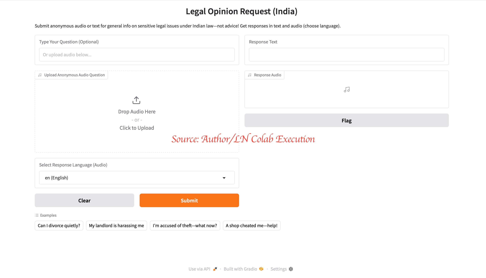
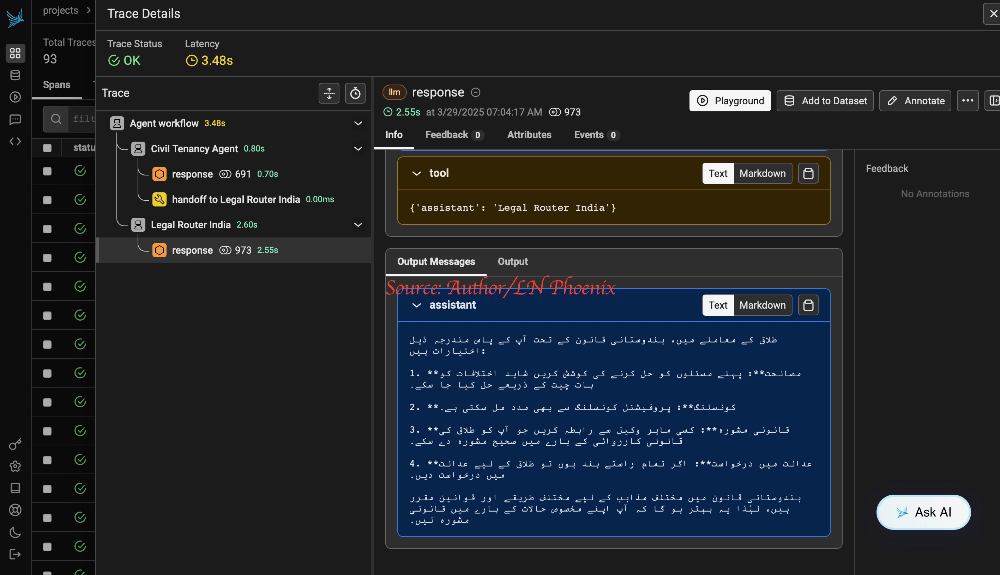
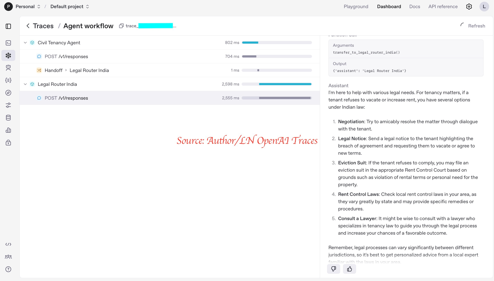

# 🧑‍⚖️ Legal Voice Assistant (India) — Built with OpenAI Agents & Gradio

> A voice-enabled legal information agent that accepts **anonymous audio or text questions** on Indian law and responds in **text and audio** — with multilingual support.  
> ⚠️ **Disclaimer:** This tool provides general information, not legal advice.

---

## 🔧 Features

- 🎙️ Voice input using **`gpt-4o-mini-transcribe`** (audio processed on submit)
- 🧠 Legal-specific multi-agent routing via OpenAI Agents SDK
- 🗣️ Audio responses using OpenAI **`tts-1`** voice model
- 🌐 Multilingual audio output (English, Hindi, Tamil, Bengali, Telugu, Marathi)
- 📦 Gradio interface for anonymous legal questions
- 🔐 Privacy-focused: no voice data stored or logged
- 🛠️ Tracing support using **Phoenix** and **OpenAI's native trace UI**

---

## 🖼️ Demo UI Screenshot



---

## 🧪 Try It Yourself (Locally or via Colab)

1. **Install dependencies**
   ```bash
   pip install openai-agents gradio python-dotenv
   ```

2. **Set your API key**
   ```bash
   export OPENAI_API_KEY="your-openai-api-key"
   ```

3. **Run the notebook**
   - Launch: `Medium__March29_LegalVoice_OpenAIAgents_OpenAIAudioipynb.ipynb`

---

## 🧬 Architecture Overview


**Voice Pipeline Flow:**
1. Audio input (uploaded file)
2. Transcription using `gpt-4o-mini-transcribe`
3. Processed through legal agent chain
4. Response synthesized with `tts-1` (and displayed)

---

## 🧠 Supported Legal Topics

- Family law (divorce, domestic violence)
- Tenancy disputes and eviction
- Criminal law (harassment, false accusation)
- Consumer protection (fraud, refunds)

> ⚠️ All responses are general legal information — **not** a substitute for legal advice.

---

## 🔍 Implementation Highlights

1. **Modular voice pipeline** (STT → LLM → TTS)
2. **Multi-agent system** with domain-specific legal tools
3. **Language adaptation** with TTS support for 6 Indian languages
4. **Fallback logic** for silent or unclear input
5. **UI built with Gradio** for anonymous submission
6. **Tracing and Observability** using:
   ```python
   # Phoenix tracing setup
   PHOENIX_API_KEY = "your_phoenix_api_key_here"
   os.environ["PHOENIX_CLIENT_HEADERS"] = f"api_key={PHOENIX_API_KEY}"
   os.environ["PHOENIX_COLLECTOR_ENDPOINT"] = "https://app.phoenix.arize.com"
   from phoenix.otel import register
   tracer_provider = register(project_name="openai_agents", auto_instrument=True)
   ```

📸 _Tracing Screenshots:_

| Phoenix Trace | OpenAI Trace |
|---------------|--------------|
|  |  |

---

## 📁 Project Structure

```
├── samples/                          # Sample voice files (your own voice)
│   ├── divorce_question_en.mp3
│   ├── harassment_te.mp3
│   ├── tenant_dispute_hi.mp3
│   └── consumer_fraud_ta.mp3
│   └── README.md                    # Usage notice + descriptions
├── interface_screenshot.jpeg        # Gradio UI
├── voice_pipeline.png               # Architecture diagram
├── phoenix_trace.jpeg               # Trace from Phoenix dashboard
├── openai_trace.jpeg                # OpenAI trace view
├── Medium__March29_LegalVoice_*.ipynb
├── README.md (this file)
```

---

## 📚 References

- [🔗 OpenAI Agents SDK](https://platform.openai.com/docs/guides/agents)
- [🔗 Gradio Documentation](https://www.gradio.app/guides/)
- [🔗 Arize Phoenix for Tracing](https://docs.arize.com/phoenix/)
- [🔗 Related Article on Medium](https://medium.com/@LakshmiNarayana_U/beyond-assistants-developing-autonomous-workflows-with-openais-agents-sdk-0eaa0420ffa3)

---

## 🙋 Author Note

This system was designed and tested using real voice queries recorded by the author.  
For test samples, see the `samples/` directory.  
Feedback and collaboration welcome!
