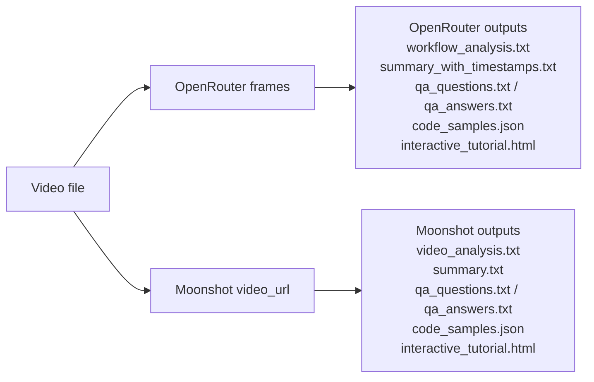

# Kimi K2.5: From Agent Swarms to Production Pipelines  
A hands‑on, reproducible video‑to‑docs pipeline using Kimi K2.5 via OpenRouter (frames) and Moonshot (direct video).

## What this repo does
- Converts tutorial videos into structured documentation
- Generates step‑by‑step workflows, code samples, summaries, and Q&A
- Produces a single‑page HTML documentation output

---

## Architecture (Mermaid Diagram)



---

## OpenRouter vs Moonshot (Comparison)

| Feature | OpenRouter (frames) | Moonshot (video_url) |
|---|---|---|
| Video input | ❌ base64 video not supported in our test | ✅ base64 video supported |
| Frame analysis | ✅ multi‑frame in single call | ✅ (via video input) |
| Long‑context coherence | ✅ (explicitly prompted) | ✅ (direct video analysis) |
| Best use case | Frame‑based workflows & routing | Direct video analysis |
| Output reliability | Good but HTML may need parsing fixes | Good but requires Moonshot key |

---

## Quickstart

```bash
python -m venv .venv
source .venv/bin/activate
pip install -r requirements.txt
cp .env.example .env
```

Set keys in `.env`:
- `OPENROUTER_API_KEY`
- `MOONSHOT_API_KEY` (for video_url)
- optional: `OPENROUTER_BASE_URL`, `SITE_URL`, `SITE_NAME`

---

## Demo Script (Recommended)

### A) OpenRouter frames (single call, full coherence)
```bash
python main.py --video "inputs/your_video.mp4" --context "Short context" --qa-auto
```

### B) Moonshot direct video analysis
```bash
MOONSHOT_API_KEY=... \
python video_processor_kimi_video.py --video "inputs/your_video.mp4" --prompt "Describe the video step-by-step."
```

### C) Moonshot video + OpenRouter docs (one command)
```bash
MOONSHOT_API_KEY=... OPENROUTER_API_KEY=... \
python video_full_pipeline.py --video "inputs/your_video.mp4" --context "Short context"
```

---

## Suggested Repo Files to Include

Core:
- `main.py`
- `openrouter_client.py`
- `video_processor.py`
- `config.py`
- `requirements.txt`
- `.env.example`
- `.gitignore`

Pipelines:
- `video_processor_kimi_video.py`
- `video_analysis_to_docs.py`
- `video_full_pipeline.py`
- `video_full_pipeline_moonshot.py`
- `video_full_pipeline_moonshot_single_prompt.py`

Docs:
- `README.md` (this file)
- `TRY_OUT_GUIDE.md`
- `APPROACH.md`
- `TESTING_NOTES.md`
- `SESSION_REPORT.md`

