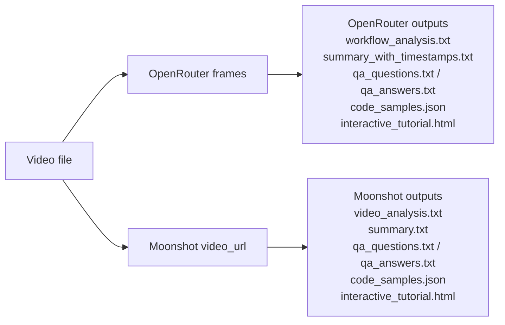

# Kimi K2.5: From Agent Swarms to Production Pipelines
A hands‑on, reproducible video‑to‑docs pipeline using Kimi K2.5 via OpenRouter (frames) and Moonshot (direct video).

## What this repo does
- Converts tutorial videos into structured documentation
- Generates step‑by‑step workflows, code samples, summaries, and Q&A
- Produces single‑page HTML documentation output and related artifacts

---

## Prerequisites
- Python 3.9+ (or compatible)
- pip and virtualenv
- ffmpeg (optional, recommended for robust frame extraction)
- API keys in a .env file:
  - `OPENROUTER_API_KEY` (required for OpenRouter/frame flows)
  - `MOONSHOT_API_KEY` (required for Moonshot direct video flows)
  - Optional: `OPENROUTER_BASE_URL`, `SITE_URL`, `SITE_NAME`

Copy the example env file:

```bash
cp .env.example .env
# then edit .env to set your keys
```

---

## Architecture (Mermaid Diagram)



---

## OpenRouter vs Moonshot (Comparison)

| Feature | OpenRouter (frames) | Moonshot (video_url) |
|---|---|---|
| Video input | Frame images (data:image/*;base64). This repo uses extracted frames via video_processor.py | Full video as a data:video/*;base64 URL (video_processor_kimi_video.py / Moonshot) |
| Frame analysis | ✅ multi‑frame in single call | ✅ (via video input in Moonshot) |
| Base64 video supported? | ❌ Not supported in OpenRouter frame path (use frames) | ✅ Moonshot supports base64 video_url (but be careful with size) |
| Long‑context coherence | ✅ (explicitly prompted in analysis) | ✅ (direct video analysis) |
| Best use case | Frame‑based workflows & routing, when you want fine control of frames | Direct video analysis for short clips or when a single-shot analysis is desired |
| Output reliability | Good but HTML may need parsing/cleanup | Good but requires Moonshot API key and careful size handling |

Notes:
- Moonshot accepts a base64-embedded video but this can be very large — prefer short clips or upload to external storage and provide a URL.

---

## Quickstart

```bash
python -m venv .venv
source .venv/bin/activate
pip install -r requirements.txt
cp .env.example .env
# Edit .env to add your API keys
```

### Example commands

A) OpenRouter frames (recommended for coherent, frame-based analysis)

```bash
python main.py --video "inputs/your_video.mp4" --context "Short context" --qa-auto
```

B) Moonshot direct video analysis

```bash
MOONSHOT_API_KEY=... \
python video_processor_kimi_video.py --video "inputs/your_video.mp4" --prompt "Describe the video step-by-step."
```

C) Moonshot video + OpenRouter docs (end-to-end)

```bash
MOONSHOT_API_KEY=... OPENROUTER_API_KEY=... \
python video_full_pipeline.py --video "inputs/your_video.mp4" --context "Short context"
```

---

## Scripts and outputs (mapping)

- main.py
  - Inputs: video -> extracts frames via video_processor.py
  - Outputs (default ./output): workflow_analysis.txt, summary_with_timestamps.txt, code_samples.json
- video_processor_kimi_video.py
  - Inputs: video -> sends base64 video to Moonshot
  - Outputs (default ./output_video_openrouter): video_analysis.txt
- video_analysis_to_docs.py
  - Inputs: analysis file (video_analysis.txt)
  - Outputs (default ./output_video_openrouter_docs): summary.txt, qa_questions.txt, qa_answers.txt, code_samples.json
- video_full_pipeline.py / video_full_pipeline_moonshot_single_prompt.py
  - End-to-end orchestration combining Moonshot and OpenRouter steps; outputs placed in their configured output directories

---

## Known issues & troubleshooting

- Very large video files: embedding the full video as base64 can exceed memory or API limits. Trim the video or host it externally and provide a stable URL if possible.
- FPS == 0 or corrupted video: the frame extractor may report duration=0. Use ffmpeg to re-encode or provide a short clean clip.
- Missing API keys: you will get a clear ValueError; ensure keys are set in .env or environment.
- Partial/fragile HTML in model outputs: some generated HTML may need minor post-processing to be valid. The repo provides helpers to extract fenced HTML but review interactive_tutorial.html before publishing.
- Costs: this pipeline uses token-based models. Monitor token usage printed during runs and set reasonable MAX_FRAMES / MAX_STEPS.

---

## Cost & safety notes
- The Config class contains COST_PER_M_INPUT and COST_PER_M_OUTPUT (USD per 1M tokens) as estimates. Update these values according to provider pricing.
- Test on short clips to estimate cost before running a long video.

---

## Development & contribution
- Pin dependency ranges in requirements.txt for reproducible installs (optional).
- Add a small CI job (smoke test) that runs an import and the frame extractor on a tiny test video to detect regressions.
- If you change provider behavior or prompt formats, update review_by_github_pilot_for_future.md with rationale.

---

## Example outputs
- workflow_analysis.txt — a coherent, numbered workflow narrative
- code_samples.json — list of small HTML/code snippets per step
- interactive_tutorial.html — single-page HTML combining summary, code, and Q&A

---

## Where to view the source
The pipeline source files live under:
`KimK2.5_From_Agent_Swarms_to_Production_Pipelines/` in this repository.

---

## License
Add a LICENSE file if you plan to publish or share widely. For experiments, include a short note about dataset/copyright for sample videos.
