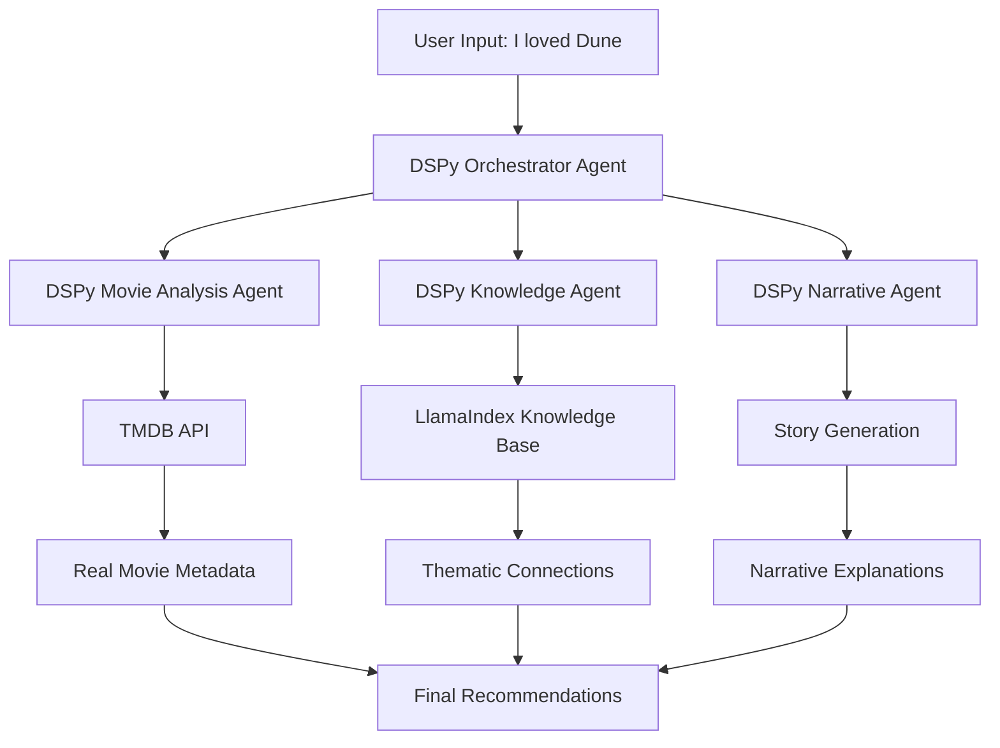

# 🎬 Multi-Agent Cinema Storyteller
## Built with DSPy, LlamaIndex & TMDB API

> **Movie recommendation system using DSPy multi-agent coordination, LlamaIndex knowledge retrieval, and TMDB API to provide narrative explanations for recommendations**


[](https://opensource.org/licenses/MIT)
[](https://www.python.org/downloads/)
[](https://github.com/stanfordnlp/dspy)
[](https://www.llamaindex.ai/)
[](https://www.themoviedb.org/documentation/api)

## 🚀 **Overview**

This system leverages **DSPy** for multi-agent coordination, **LlamaIndex** for knowledge retrieval, and **TMDB API** for movie data to provide narrative explanations instead of similarity scores:

**Traditional Approach:**
```
• The Matrix (87% match)
• Blade Runner (84% match)  
• Ghost in the Shell (81% match)
```

**Multi-Agent Approach:**
```
🤖 Agent Analysis: "The Matrix connects to Dune through exploration of consciousness, 
chosen ones, and destiny. Both films examine the burden of knowledge and the 
hero's journey through philosophical questions about reality."

🎭 Thematic Connections: Consciousness, destiny, visual storytelling
🎬 Reasoning: Detailed explanation of thematic and stylistic connections
```

## 🎯 **Features**

- **DSPy Multi-Agent Coordination**: Orchestrator coordinates specialist agents (Analysis, Knowledge, Narrative)
- **Hypothesis-Based Analysis**: DSPy agents analyze why users liked specific movies
- **LlamaIndex Knowledge Retrieval**: Builds thematic connections between movies using vector search
- **TMDB Integration**: Real-time access to 500,000+ movies with complete metadata
- **Quality Filtering**: Multi-strategy filtering prioritizes highly-rated movies

## 🏗️ **Architecture**



## 🛠️ **Tech Stack**

### **Core Technologies:**
- **🧠 DSPy**: Multi-agent framework for coordinating specialist agents
- **🔍 LlamaIndex**: Knowledge retrieval and thematic connection building
- **🎬 TMDB API**: Live movie metadata and recommendations (500,000+ movies)

### **Supporting Technologies:**
- **📊 MLflow**: Experiment tracking for agent interactions
- **🌐 Gradio**: Interactive web interface
- **☁️ Google Colab**: Development and deployment platform

## 📦 **Installation & Setup**

### **Option 1: Google Colab (Recommended)**
1. **Open in Colab**: Click [here](https://colab.research.google.com/github/Laksh-star/Medium_Articles/blob/main/Learning_Multi-Agent_Systems_with_DSPy_A_Hands-On_Guide/Medium_True_Multiagent_system_storyteller.ipynb)
2. **Run all cells** to install dependencies automatically
3. **Add your API keys** when prompted

### **Option 2: Local Setup**

### **1. Clone Repository**
```bash
git clone https://github.com/Laksh-star/Medium_Articles.git
cd Medium_Articles/Learning_Multi-Agent_Systems_with_DSPy_A_Hands-On_Guide
```

### **2. Install Dependencies**
```bash
pip install dspy llama-index mlflow requests gradio openai
```

### **3. Set Up API Keys**
```python
# Required API Keys
OPENAI_API_KEY = "your-openai-api-key"
TMDB_API_KEY = "your-tmdb-api-key"  # Free from themoviedb.org
DATABRICKS_TOKEN = "your-databricks-token"  # Optional: for MLflow tracking
```

### **4. Run the System**
Open the Jupyter notebook in Google Colab or Jupyter:
```bash
# In Google Colab: Upload Medium_True_Multiagent_system_storyteller.ipynb
# Or locally:
jupyter notebook Medium_True_Multiagent_system_storyteller.ipynb
```

## 🎮 **Usage Examples**

### **Classic Cinema:**
```
Input: "Seven Samurai"
Output: Yojimbo, Rashomon, Ikiru
Reasoning: "Kurosawa's exploration of honor and moral complexity..."
```

### **Sci-Fi:**
```
Input: "Blade Runner 2049" 
Output: Arrival, Ex Machina, Her
Reasoning: "Denis Villeneuve's philosophical approach to AI consciousness..."
```

### **Action:**
```
Input: "Die Hard"
Output: Die Hard 2, Speed, The Rock
Reasoning: "Confined space thrillers with everyman heroes..."
```

## 🔍 **Technical Details**

### **Quality Filtering**
- **TMDB Recommendations**: Uses TMDB's recommendation API
- **Genre-Based Discovery**: Filters movies by genre with release date awareness  
- **Vote Count Thresholds**: Filters out low-rated movies
- **Multi-Strategy Approach**: Combines 3 recommendation sources with priority ranking

### **Agent Architecture**
- **Orchestrator**: Coordinates agents and manages data flow
- **Movie Analysis**: Extracts themes, director style, and cast information
- **Knowledge Agent**: Builds thematic connections using LlamaIndex
- **Narrative Agent**: Generates explanatory text for recommendations

### **Tracking and Monitoring**
- **MLflow Integration**: Logs agent interactions and performance metrics
- **Quality Metrics**: Tracks confidence scores and recommendation sources
- **Debug Output**: Provides visibility into agent decision-making
- **Performance Analytics**: Monitors agent coordination success rates

## 🚀 **Demo Interface**

The system includes a Gradio web interface that runs in Google Colab and allows users to:

1. **Enter movie titles** from TMDB's database
2. **View agent coordination** process in real-time
3. **Receive 3 recommendations** with narrative explanations
4. **See reasoning** for each recommendation

**Quick Start**: Open the [Colab notebook](https://colab.research.google.com/github/Laksh-star/Medium_Articles/blob/main/Learning_Multi-Agent_Systems_with_DSPy_A_Hands-On_Guide/Medium_True_Multiagent_system_storyteller.ipynb) and run all cells!

## 📈 **Performance Metrics**

- **Database Coverage**: 500,000+ movies via TMDB API
- **Quality Threshold**: Recommendations typically rated 7.0+/10
- **Agent Coordination**: 4 specialized agents
- **Response Time**: 10-15 seconds including API calls

## 🔧 **Configuration**

### **MLflow Setup** (Optional)
```python
DATABRICKS_HOST = "https://your-databricks-instance.cloud.databricks.com"
mlflow.set_tracking_uri("databricks")
mlflow.set_experiment("/path/to/your/experiment")
```

### **Debug Mode**
```python
# Enable debug output to see agent reasoning
multiagent_demo.launch(share=True, debug=True)
```

## 📁 **Project Structure**

```
Medium_Articles/
└── Learning_Multi-Agent_Systems_with_DSPy_A_Hands-On_Guide/
    ├── Medium_True_Multiagent_system_storyteller.ipynb  # Main Jupyter notebook
    ├── README.md                                        # This file
    └── requirements.txt                                 # Dependencies (optional)
```

## 📝 **License**

This project is licensed under the MIT License - see the [LICENSE](LICENSE) file for details.

## 🙏 **Acknowledgments**

- **DSPy**: Stanford's framework for programming language models and multi-agent systems
- **LlamaIndex**: For powerful knowledge retrieval and vector search capabilities
- **TMDB**: For providing comprehensive movie database API with 500,000+ movies
- **OpenAI**: For language model capabilities
- **Gradio**: For interactive web interface framework

## 🐛 **Known Limitations**

- **Rate Limiting**: TMDB API limited to 40 requests per 10 seconds
- **Response Time**: 10-15 seconds for complex queries due to API calls
- **Genre Matching**: Occasional mismatches for older films


---

**Built by [Laksh-star](https://github.com/Laksh-star)**

> *A multi-agent approach to movie recommendations using narrative explanations.*

**Part of**: [Learning Multi-Agent Systems with DSPy - A Hands-On Guide](https://github.com/Laksh-star/Medium_Articles/tree/main/Learning_Multi-Agent_Systems_with_DSPy_A_Hands-On_Guide)
