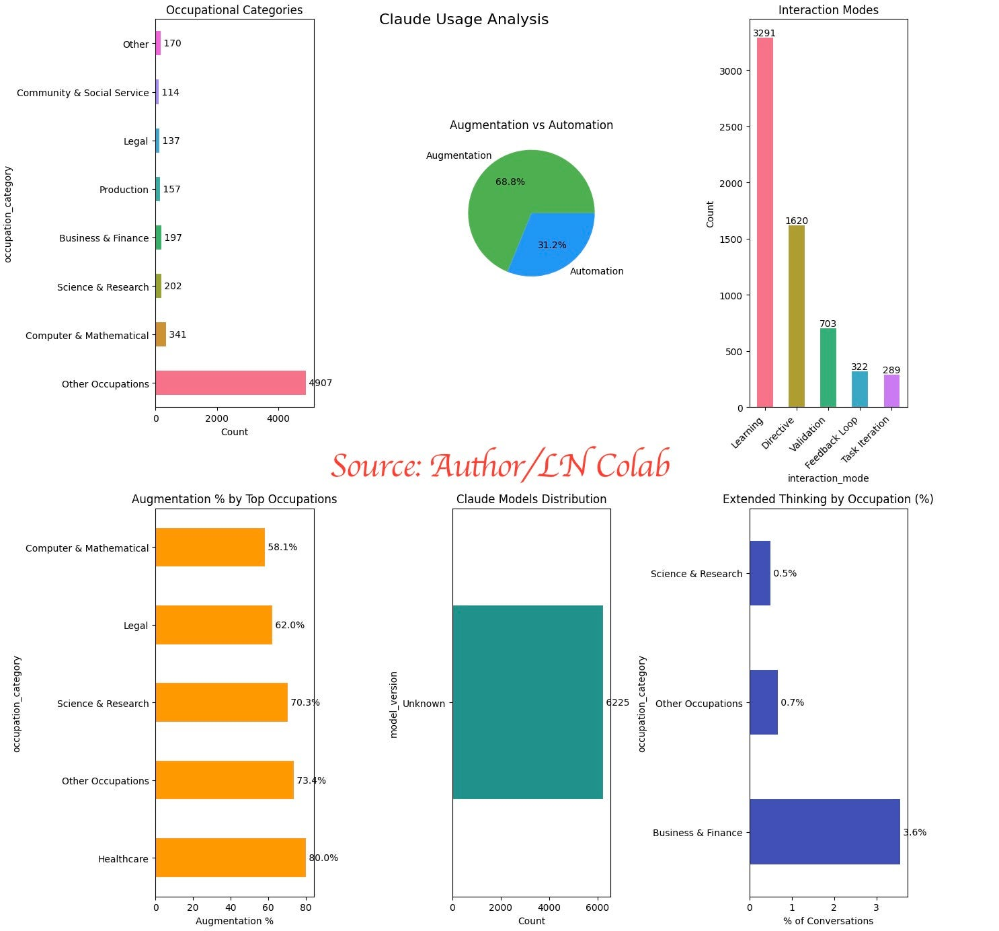

# Claude AI Economic Analysis Tool

This repository contains a Python notebook (`Medium_Claude_Data_Analysis_April2_2025.ipynb`) for analyzing Claude AI conversations following the methodology established in Anthropic's Economic Index research reports. The tool allows you to visualize and understand your personal Claude AI usage patterns through the lens of occupational categories, interaction modes, and augmentation vs. automation patterns.

## Overview

Anthropic's Economic Index provides valuable insights into how AI is being used across different occupations and tasks. This tool brings similar analysis capabilities to individual users, allowing you to:

- Categorize your Claude conversations by occupational categories
- Analyze interaction modes (Learning, Task Iteration, Validation, Directive, Feedback Loop)
- Measure augmentation vs. automation patterns in your AI usage
- Track extended thinking mode usage across different task types
- Visualize results through comprehensive dashboards

## Features

- **Occupation Category Classification**: Maps conversations to categories like Computer & Mathematical, Education & Training, Healthcare, etc., following Anthropic's taxonomy
- **Interaction Mode Analysis**: Classifies conversations into five interaction modes (Learning, Task Iteration, Validation, Directive, Feedback Loop)
- **Augmentation/Automation Detection**: Determines whether conversations reflect augmentative or automative patterns
- **Extended Thinking Analysis**: Tracks usage of Claude 3.7 Sonnet's extended thinking mode across different tasks
- **Privacy-Focused**: All analysis happens locally on your machine with no data shared externally
- **Comprehensive Visualization**: Creates detailed dashboards showing your AI usage patterns
- **Exportable Datasets**: Generates datasets similar to those released by Anthropic for further analysis

## Installation

```bash
# Clone the repository
git clone https://github.com/Laksh-star/Medium_Articles.git
cd Medium_Articles/The_AI_Economic_Observatory_What_Claude_3.7_Sonnet_Reveals_About_Our_Working_Future

# Install required dependencies
pip install pandas numpy matplotlib seaborn jupyter
```

## Usage

### Basic Usage

You can run the notebook `Medium_Claude_Data_Analysis_April2_2025.ipynb` in Jupyter:

```bash
jupyter notebook Medium_Claude_Data_Analysis_April2_2025.ipynb
```

Or you can import the functions from the notebook in your own script:

```python
# First run the notebook to define all functions, or copy them to your script
import pandas as pd
import matplotlib.pyplot as plt

# Load your Claude exports
users_df = load_user_data('users.json')
df = load_and_process_chats('conversations.json', users_df)

# Run the analysis
results, processed_df = analyze_chats_streamlined(df)

# Display visualization dashboard
plt.show()
```

### Creating Datasets

The notebook also includes functions to create datasets for further analysis:

```python
# Create datasets for further analysis
task_occ_df = create_task_occupation_dataset(processed_df)

# Save sample conversations for validation
save_validation_samples(processed_df)
```

## Input Data

The tool expects Claude conversation exports in the following format:

- `users.json`: Contains user information
- `conversations.json`: Contains Claude conversation history

You can export these files from Claude.ai in your account settings.

## Output

The tool produces several outputs:

1. **Interactive visualization dashboard**: Shows occupation distribution, interaction modes, augmentation vs. automation, extended thinking usage, etc.
2. **Statistics summary**: Provides key metrics about your Claude usage
3. **Datasets**:
   - `task_occupation_analysis.csv`: Maps tasks to occupations with usage metrics
   - `validation_samples.json`: Sample conversations for each category

## Research Methodology

This tool implements the methodology described in Anthropic's Economic Index research:

- [The Anthropic Economic Index](https://www.anthropic.com/news/the-anthropic-economic-index)
- [Economic Tasks AI Paper](https://assets.anthropic.com/m/2e23255f1e84ca97/original/Economic_Tasks_AI_Paper.pdf)

Key concepts from the research:

- **Occupational Categories**: Based on O*NET categories adapted by Anthropic
- **Interaction Modes**:
  - **Learning**: Information gathering and explanation
  - **Task Iteration**: Collaborative refinement of work
  - **Validation**: Verifying or checking work
  - **Directive**: Complete task delegation
  - **Feedback Loop**: More interactive automation scenarios
- **Augmentation vs. Automation**: Whether AI is used to enhance human capabilities (augmentation) or replace human tasks (automation)

## Example Analysis

Here's an example of what the analysis dashboard looks like:



## Limitations

While this tool provides valuable insights, it has some limitations:

- Classification accuracy depends on pattern recognition rather than deep semantic understanding
- Limited to the conversations in your export (no visibility into how outputs are used beyond the conversation)
- Cannot track external factors that might influence usage patterns
- Uses simplified classification compared to Anthropic's more sophisticated Clio platform

## Accompanying Article

This code was created as part of the article "The AI Economic Observatory: What Claude 3.7 Sonnet Reveals About Our Working Future" published on Medium. The article explores how analyzing conversations with Claude can reveal insights about AI's economic impact, following Anthropic's Economic Index methodology.

## Related Articles

You might also be interested in other articles in this series:
- "AI Interactions Explored: Insights and ChatGPT Analysis Guide"
- "The AI Workforce Dialogue: How Conversations Are Shaping the Future of Work"

## Contributing

Contributions are welcome! Please feel free to submit a Pull Request.

## Author

Lakshmi Narayana U. - Check out more of my work on [Medium](https://medium.com/@lakshmi-narayan-u) and [GitHub](https://github.com/Laksh-star/).

## Acknowledgments

- Anthropic for their groundbreaking research on AI's economic impact through the Anthropic Economic Index
- The Claude AI team for creating the Claude assistant and APIs that enable this kind of analysis
